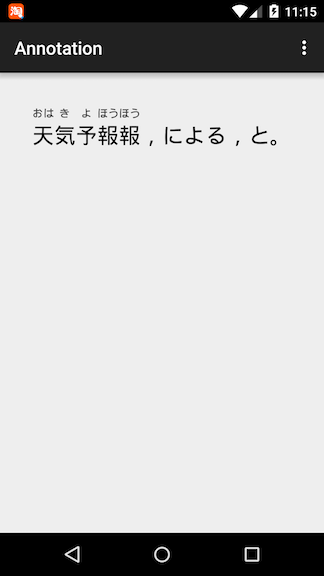

# Annotation
AnnotationView

日文注解
要求：

1. 需要标注的文本：“天気予報報，による，と。 ”

2. text_ipas_details = [
      [{text: '天', ipa: 'おは', ipa_visible: true}, {text: '気', ipa: 'き', ipa_visible: true}],
      [{text: '予', ipa: 'よ', ipa_visible: true}, {text: '報', ipa: 'ほう', ipa_visible: true}],
      [{text: 'によ', ipa: 'によ', ipa_visible: false},    {text: 'る', ipa: 'る', ipa_visible: false}],
      [{text: 'と', ipa: 'と', ipa_visible: false}] ]

     其中“text”  需要标注的文本， “ipa”  标注，“ipa_visible”  是否需要标注

3. 辅助文本：“天気予報報 による と” （去掉标点用空格分词的文本）
4. 根据上面 2 的数据结构对 1 要求的文本实现下面的标注效果（要求标注和需要标注的文本对应居中，并且标点不需要标注）

效果如下：

